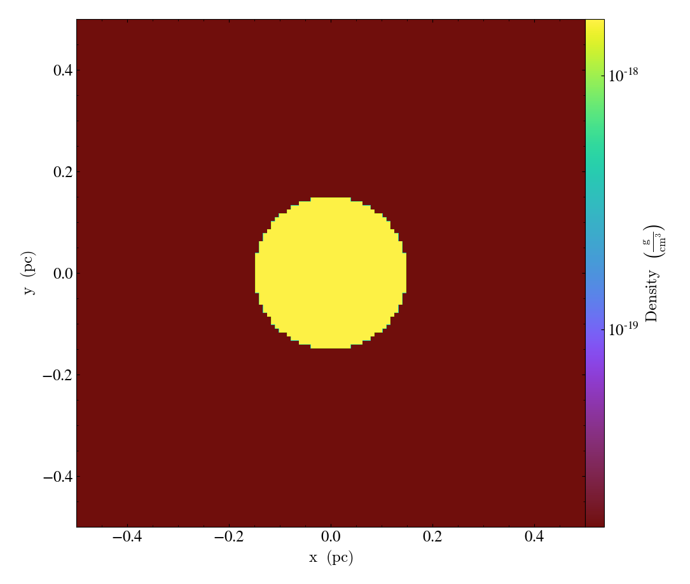
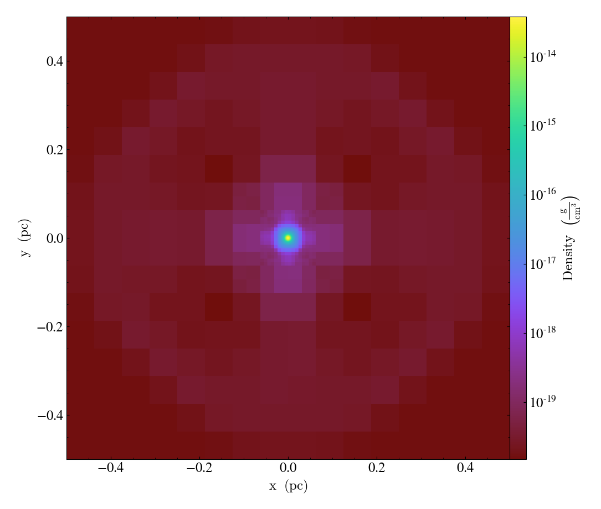

Quickstart Guide to Enzo
========================

This is the quickstart guide to using Enzo, starting from
checking out the Enzo and YT sources, through to building them, then
to running an example problem and looking at its output.

Before we get going too far, here are some websites that contain
useful information or useful tools:
 
* `github.com/enzo-project/enzo-dev <http://github.com/enzo-project/enzo-dev>`_
* `yt-project.org <http://yt-project.org>`_

If you ever get stuck, please email `enzo-users
<https://groups.google.com/forum/#!forum/enzo-users>`_. This is not
just so that you can get an answer to your question, but also to let
the developers know when something is not working or could be more
clear in the documentation. Particularly now that Enzo has many
interlocking modules, unusual combinations of parameters may require
some care, and the individual developers that have created those
modules will be able to discuss them with you.

Getting YT
------------
YT was initially developed to allow fast and easy analysis of Enzo output. Since it's
original inception YT has grown to be a powerful tool capable of analysing
many different astrophysical simulation code outputs and also non-astro
simulation outputs too.
To get your hands on YT (which you will need to complete this quickstart tutorial)
then go to the `YT installation page <https://yt-project.org/doc/installing.html>`_
and install YT locally.

Getting Enzo
------------

The simplest way to get a copy of the current stable source code is to
clone the repository using git:

::

    $ git clone https://github.com/enzo-project/enzo-dev

Git (git) is a revision-control system that is available on many
platforms (see `git-scm.org
<http://git-scm.org>`_).  

You can then use a pre-existing Makefile (if one exists for your
machine) or modify one to point to either the system-wide installation
of HDF5 and MPI or to the yt-installed HDF5 and the system-wide MPI.
However, since the process of setting up the Makefile can be a bit
tricky, it's discussed in more depth down below.

Setting Up Enzo
---------------

Change directories to the Enzo path, and the very first time you enter this
directory, execute:

::

    $ cd enzo-dev
    $ ./configure

However, you will probably not want to do this multiple times. This
wipes out all configuration settings and restores them to defaults;
this can lead to unexpected results. It usually only needs to be run
once, although in some instances (particularly when using version
control) it may need to be run multiple times.

In this directory there are several subdirectories:

 * **bin** This directory is seldom-used.
 * **doc** This directory contains both the older documentation and
   the newer documentation. The newer documentation is under ``manual``.
   Note that the newer documentation is in a format called ReStructured
   Text, which is converted to HTML to be posted on the website. It can
   be read in plain text.
 * **input** These are files used as input to several problems,
   including radiative cooling tables. If Enzo fails at startup with a
   missing file, it is likely in this directory. There are some
   additional scripts as well.
 * **run** This directory contains example parameter files along with
   notes about expected output and scripts for plotting. This is also the
   basis of the Enzo answer test suite, which compares results from one
   version of the code to results from previous versions of the code.
 * **src** All the Enzo source, along with its affiliated utilities
   (described below) is contained here.

The source for Enzo and its tools is contained in ``src/``.

Building Enzo
-------------

Enzo uses CMake to configure and build all components across platforms.
To build Enzo with default options (64-bit precision, MPI enabled, HDF5 enabled), change into the top-level repository directory and execute:

::

    $ make

This automatically invokes CMake and compiles all binaries into the ``bin/`` directory (``bin/enzo``, ``bin/inits``, ``bin/enzohop``, etc.).

Customizing Build Options
+++++++++++++++++++++++++

To customize configuration options (precision, external libraries, physics features), use ``cmake -B build -S .`` with ``-DOPTION=VALUE`` flags:

::

    $ cmake -B build -S . -DENZO_PRECISION=64 -DENZO_USE_GRACKLE=ON
    $ cmake --build build

Common CMake options include:

- ``-DENZO_PRECISION=32|64``: Floating-point precision (default: 64)
- ``-DENZO_INTEGERS=32|64``: Grid integer size (default: 64)
- ``-DENZO_USE_MPI=ON|OFF``: Enable/disable MPI (default: ON)
- ``-DENZO_USE_GRACKLE=ON|OFF``: Enable Grackle cooling library (default: OFF)

For a complete reference of CMake options, see :ref:`CMakeOptions`. For historical notes on the legacy ``Make.mach.*`` Makefile system, see :ref:`LegacyMakeOptions`.

If this command fails, checking over the output of out.compile may
indicate why. If this command fails and the error output does not help
to elucidate why, please feel free to email enzo-users-l with the
error output and your Make.mach file.

If the compilation succeeds, Enzo will report this to you and a new
file named enzo.exe will be created.

Running a Test Problem
----------------------

We'll now try running Enzo on a test problem. Copy enzo.exe to the
run/Hydro/Hydro-3D/CollapseTestNonCosmological directory, and then
change to that directory.

::

    $ cp enzo.exe ../../run/Hydro/Hydro-3D/CollapseTestNonCosmological
    $ cd ../../run/Hydro/Hydro-3D/CollapseTestNonCosmological

If you plan on doing Enzo development, you may wish to use ln -s
instead of cp to enable faster turnaround.

We'll now start Enzo using the parameter file in that directory. You
can examine that parameter file before beginning, as it is commented.
All Enzo parameters are listed and described in the documentation, but
it's also often convenient to simply grep through the source for
them.

To execute Enzo, we're going to tell it the parameter file and
supply the -d argument, indicating debug mode.

::

    $ ./enzo.exe -d CollapseTestNonCosmological.enzo

On some machine you may have to execute this using mpirun or in a
batch cluster. For the purposes of this bootstrap, we will assume that
execution in serial on the current host is acceptable.

This problem will run for a little while, and it will create outputs
in the current directory at fixed time intervals. Each output will be
self-contained in a directory, matching the pattern DD####/DD####
where #### is a 0-padded, 4 digit counter.

Examining the Output
--------------------

The first thing to do is to take a slice of the initial conditions. If
you have set up the path to yt correctly as indicated by its install
script, you should be able to execute this command:

::

    $ yt plot DD0000/DD0000

This will take three slices through the center of the domain along
each axis, as sliced through the very first output. The images will be
saved to the subdirectory frames. Here is a plot of the outputs that can be
expected from the DD0000 snapshots:

 

Now let's take a look at DD0010 :
   
::

    $ yt plot DD0010/DD0010

 

By this point the simulation has not collapsed very far. Feel free to
check later outputs (e.g. the yt output from DD0070 shown below)

 

Another handy command is yt stats, which will describe the current
state of the simulation in a couple metrics.

Wrapping Up, Where Else to Go
-----------------------------

At this point, you've (hopefully!) run an Enzo simulation. You
should also have ``yt`` set up.

With luck this has gotten you started. The Enzo documentation contains
pointers and cookbook ideas, but the run/ directory also contains many
helpful parameter files and plotting scripts. The yt documentation (at
`yt-project.org`) also contains a number of sample recipes
for analysis as well as many more complicated examples and documents.

Please feel encouraged to sign up for the `enzo-users
<https://groups.google.com/forum/#!forum/enzo-users>`_ and the yt
mailing lists, and ask any questions there if you have them.

Good luck!

Enzo enjoys the support of numerous universities, funding agencies and
labs.

